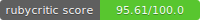

 

# Args Kata

## Pre-requisitos

Antes de iniciar debes instalar las siguientes herramientas, evaluar tu código e identificar posibles mejoras.

- [ ] [Instalar y utilizar Rubocop](https://github.com/bright-coders/commons/tree/master/topics/rubocop)
- [ ] [Instalar y utilizar Rubycritic](https://github.com/bright-coders/commons/tree/master/topics/rubycritic)
- [ ] [Instalar y utilizar SandiMeter](https://github.com/makaroni4/sandi_meter)

## Requerimientos funcionales

This Kata is presented in Robert C.. Martin’s book “Clean Code”, chapter 14. and was taken from [CodingDojo website](https://codingdojo.org/)

### Problem Description

Most of us have had to parse command-line arguments from time to time. If we don’t have a convenient utility, then we simply walk the array of strings that is passed into the main function. There are several good utilities available from various sources, but they probably don’t do exactly what we want. So let’s write another one!

The arguments passed to the program consist of flags and values. Flags should be one character, preceded by a minus sign. Each flag should have zero, or one value associated with it.

- [ ] You should write a parser for this kind of arguments. 
- [ ] This parser takes a schema detailing what arguments the program expects. 
- [ ] The schema specifies the number and types of flags and values the program expects.
- [ ] Once the schema has been specified, the program should pass the actual argument list to the args parser. 
- [ ] It will verify that the arguments match the schema. The program can then ask the args parser for each of the values, using the names of the flags. 
- [ ] The values are returned with the correct types, as specified in the schema.

For example if the program is to be called with these arguments:

-l -p 8080 -d /usr/logs

this indicates a schema with 3 flags: l, p, d. The “l” (logging) flag has no values associated with it, it is a boolean flag, True if present, False if not. the “p” (port) flag has an integer value, and the “d” (directory) flag has a string value.

If a flag mentioned in the schema is missing in the arguments, a suitable default value should be returned. For example “False” for a boolean, 0 for a number, and “” for a string. If the arguments given do not match the schema, it is important that a good error message is given, explaining exactly what is wrong.

If you are feeling ambitious, extend your code to support lists eg

-g this,is,a,list -d 1,2,-3,5

So the “g” flag indicates a list of strings, [“this”, “is”, “a”, “list”] and the “d” flag indicates a list of integers, [1, 2, -3, 5].

- [ ] Make sure your code is extensible, in that it is straightforward and obvious how to add new types of values.

### Clues

What the schema should look like and how to specify it is deliberately left vague in the Kata description. An important part of the Kata is to design a concise yet readable format for it.

### Suggested Test Cases

- [ ] make sure you have a test with a negative integer (confusing - sign)
- [ ] the order of the arguments need not match the order given in the schema.
- [ ]have some tests that suitable default values are correctly assigned if flags given in the schema are missing in the args given.

## Requerimientos no-funcionales
- Calidad
  - [ ] Utilizar estilo de código definido por la comunidad (apoyarse en Rubocop)
  - [ ] Pruebas unitarias
  - [ ] Puntuación en Rubycritic: por lo menos 95 en la carpeta de la App y por lo menos 65 en la carpeta de pruebas
  - [ ] Utilizar [SandiMeter](https://github.com/makaroni4/sandi_meter) para analizar el código y utilizar el resultado para hacer mejoras
- Ejecución
  - [ ] Puede ejecutarse desde la linea de comandos y mostrar la salida en consola
- Código fuente
  - [ ] Orientado a Objetos 
  - [ ] Métodos Pequeños
  - [ ] [Aplicar los principios SOLID](https://rubygarage.org/blog/solid-principles-of-ood)

## Tecnologías
- [ ] Lenguaje de programación Ruby
- [ ] Framework para pruebas [Rspec](https://rspec.info/) ó [Minitest](https://github.com/seattlerb/minitest)
- [ ] Línea de comando

## Entregable
- [ ] Código fuente en Github (1 por equipo)
- [ ] Incluir en el repositorio el [SmallBadge](https://github.com/jorge27/tutorial-rubycritic-small-badge) con la puntuación obtenida por RubyCritic
- [ ] Incluir en el repositorio el reporte HTML que genera [SandiMeter](https://github.com/makaroni4/sandi_meter)
- [ ] El repositorio debe reflejar el trabajo en equipo (en la conversación del repositorio, commits)
- [ ] Debe actualizar [este archivo](setup/README.md) en donde se describa el proceso para hacer funcionar el proyecto y el nombre de los integrantes del equipo
- [ ] Los commits de Git deben ser significativos
  
## Evaluación / Revisión
Se consideran los siguientes objetivos:
- [ ] Cumplimiento de requerimientos funcionales
- [ ] Cumplimiento de requerimientos no funcionales 
- [ ] Publicar por lo menos 1 actuualización (commit) por día en el repositorio remoto
- [ ] Orientación a objetos
- [ ] Estructura de archivos
- [ ] Pruebas
- [ ] Código duplicado (no debe haber código duplicado)
- [ ] Separación de intereses (separation of concerns)
- [ ] Convenciones del lenguaje
- [ ] Claridad de la solución
- [ ] Abstracción
- [ ] Uso de características propias del lenguaje Ruby
- [ ] Uso de Git, commits bien definidos y atómicos
- [ ] Puntuación obtenida en RubyCritic
- [ ] Análisis de código obtenido por [SandiMeter](https://github.com/makaroni4/sandi_meter)

## Flujo de trabajo sugerido
1. Este ejercicio se realiza en formato de [Code Kata Grupal](https://github.com/bright-coders/commons/tree/master/topics/code-kata)
2. Dedica tiempo a leer y entender los requerimientos funcionales
3. Selecciona algún feature o requerimiento y escribe la(s) prueba(s) que debe pasar
4. Codifica la solución para ese feature (si lo consideras necesario puedes cambiar el orden es decir primero codificar y después escribir la prueba)
5. En tu primer intento no te preocupes demasiado por lo elegante de tu solución sino por pasen todas las pruebas
6. Una vez que la solución funciona, haz un ejercicio de refactorización asegurandote que las pruebas sigan pasando
7. Toma el siguiente feature o requerimiento y repite el proceso

## Resumen 
- [ ] Tienes un máximo de 5 días para terminar esta kata
- [ ] Deberás publicar por lo menos 1 actualización (commit) diaria en tu repositorio rempto
- [ ] Durante el proceso de desarrollo debes mantener actualizado este repositorio
- [ ] [Los commits deben ser significativos](https://medium.com/better-programming/you-need-meaningful-commit-messages-d869e44e98d4)
- [ ] Se requiere por lo menos la aprobación de por lo menos 2 Brightcoders
- [ ] Incluir pruebas (TDD)
- [ ] Deberás incluir el linter RuboCop en tu proyecto
- [ ] Debes utilizar Rubycritic y obtener por lo menos una puntuación de 95 en la carpeta de tu app y 65 en la de pruebas

**NO** es un examen sino un ejercicio por lo que puedes apoyarte en tus compañeros y mentores para recibir ayuda, así que si tienes dudas, pregunta, pregunta pregunta!

## Setup
En [este elnace](setup/README.md) se describen los pasos necesarios para ejecutar/probar este proyecto, así como los integrantes de este equipo

## Enlaces
### Commits
- [You Need to Write Meaningful Commit Messages](https://medium.com/better-programming/you-need-meaningful-commit-messages-d869e44e98d4) 
- [Writing meaningful git commit messages](https://medium.com/@menuka/writing-meaningful-git-commit-messages-a62756b65c81)
- [How to Write a Git Commit Message](https://chris.beams.io/posts/git-commit/)
### Tools
- [Rubocop](https://rubocop.org/)
- [Rubycritic](https://github.com/whitesmith/rubycritic) 
- [Rspec](https://rspec.info/)
- [Minitest](https://github.com/seattlerb/minitest)
- [SandiMeter](https://github.com/makaroni4/sandi_meter)
- [RubyCritic Small Badge](https://github.com/MarcGrimme/simplecov-small-badge) 
- [Tutorial SmallBadge](https://github.com/jorge27/tutorial-rubycritic-small-badge)
### Solid Principles
- [SOLID Object-Oriented Design Principles with Ruby Examples](https://rubygarage.org/blog/solid-principles-of-ood)
- [Back to Basics: SOLID](https://thoughtbot.com/blog/back-to-basics-solid)
- [SOLID Principles](https://www.netguru.com/codestories/solid-principles-1-single-responsibility-principle) 

